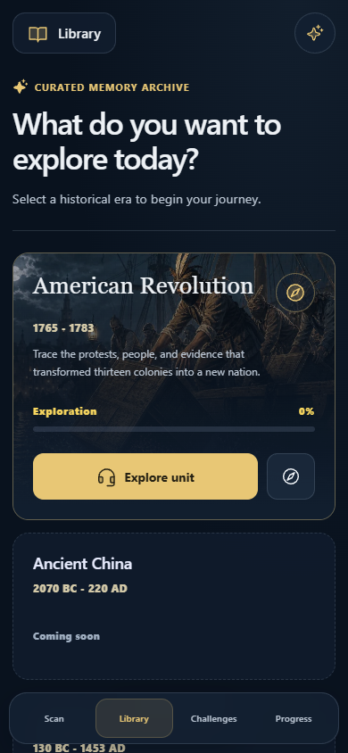

# MemQuest 界面设计规范

这轮改版延续「沉浸式历史档案」方向，不改变 Scan、Library、Challenges、Progress 的信息层级。现代化来自更清晰的文字层级、统一的控件和更克制的视觉层次，而不是增加装饰或动画。

## 统一规则

| 元素 | 规则 |
| --- | --- |
| 页面底色 | 深蓝 `#09121e`；普通内容面板 `#121f30` |
| 文字 | 主文字 `#edf1f5`；正文和辅助信息 `#bac5d2` |
| 强调色 | 暖金 `#e8c775`；主要操作使用实色，导航选中使用低透明度金色底 |
| 字体 | 应用标题、按钮、数据采用系统无衬线；历史人物名、事件名等编辑性内容保留 Georgia 衬线 |
| 圆角 | 内容面板 18px，按钮和筛选器 12px；人物头像与空间标记继续使用圆形 |
| 图片 | 使用现有历史插画和人物图像，叠加深蓝渐变；不为未上线时代制造假内容 |
| 动效 | 只用于悬停和状态反馈，尊重减少动态效果设置 |
| 可访问性 | 保留键盘焦点、状态文字和语义颜色；不单靠金色表达完成状态 |

## 各界面的侧重点

- **Library**：去掉大标题外的嵌套玻璃框，采用开放标题区；美国革命入口以真实项目素材作为背景。尚未开发的时代保持 Coming soon。
- **Explore**：保留历史场景的大画幅；标题、进入按钮和进度沿用共同控件语言。
- **Timeline / Evidence**：图片卡片仍是主要入口，详情面板与选中态统一。手机保留横向滑动容器。
- **People**：保留人物肖像、传记、角色、事件与关系图结构，降低面板装饰噪声。
- **Memory Check / Challenges / Progress**：统一应用标题、按钮、筛选器、测验面板和指标文字，不修改评分及保存规则。
- **Scan / Harbor**：与文档页面共用色彩和圆角，但使用半透明材质。扫描进行中仍隐藏大面板和底部导航。不可用普通内容面板的实色背景覆盖相机或 3D 画布。

## 继续开发时改哪里

`src/interface-theme.css` 是统一视觉层，由 `src/main.jsx` 在原有样式之后加载。开发用的浏览器 fixture 同样加载它。该文件顶部集中定义颜色、字体、圆角变量；功能布局、显示隐藏、扫描裁切和 3D 点击区域仍由原组件负责。

需要调整全局外观时优先修改公共变量或明确的组件选择器。不要为了修一个页面而覆盖所有 `button`、`section` 的尺寸，也不要改动相机模式的隐藏规则。

本轮复用已有图片，未新增字体服务、图片服务或依赖包。

## 验证与版本边界

本轮在本地完成 1440×960、390×844、844×390 的页面检查，以及模拟相机的欢迎、识别中、成功和错误状态检查。54 项应用测试、4 项 Sites 测试和生产构建通过。构建仍存在既有的较大 JavaScript 分包提醒。

模拟相机截图只能说明 UI 排布，不能证明真实手机摄像头、WebXR 或图片追踪能力。发布前仍应在实际手机上核对。**本规范不能单独证明部署状态；请对照 GitHub 提交与 Vercel 生产部署确认当前版本。**

上图来自隔离的本地学习记录，初始探索进度为零；不是用户的实际学习数据。
