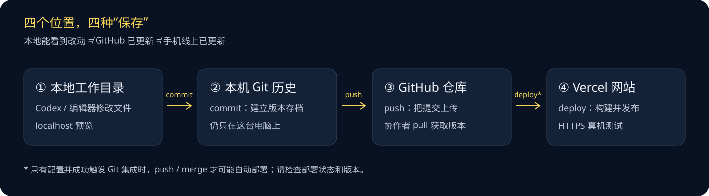
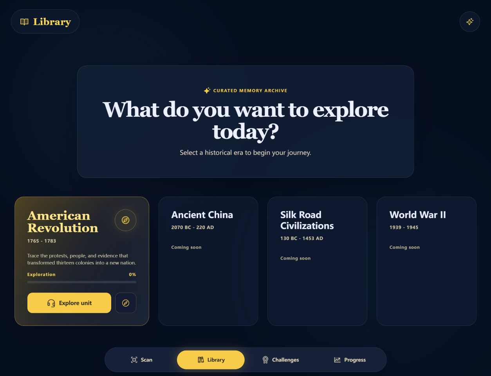
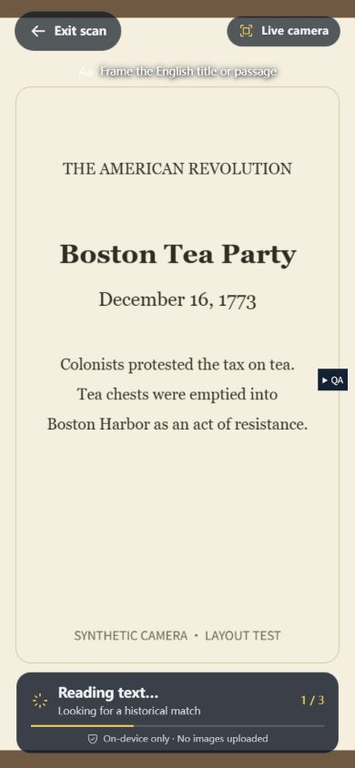
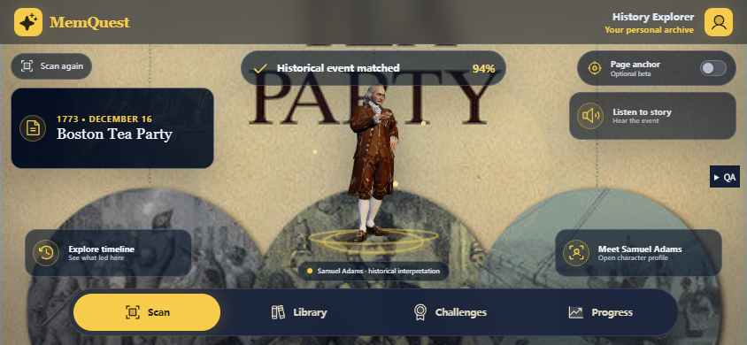
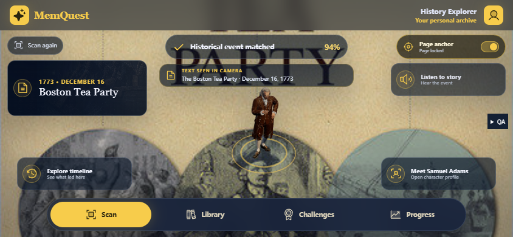
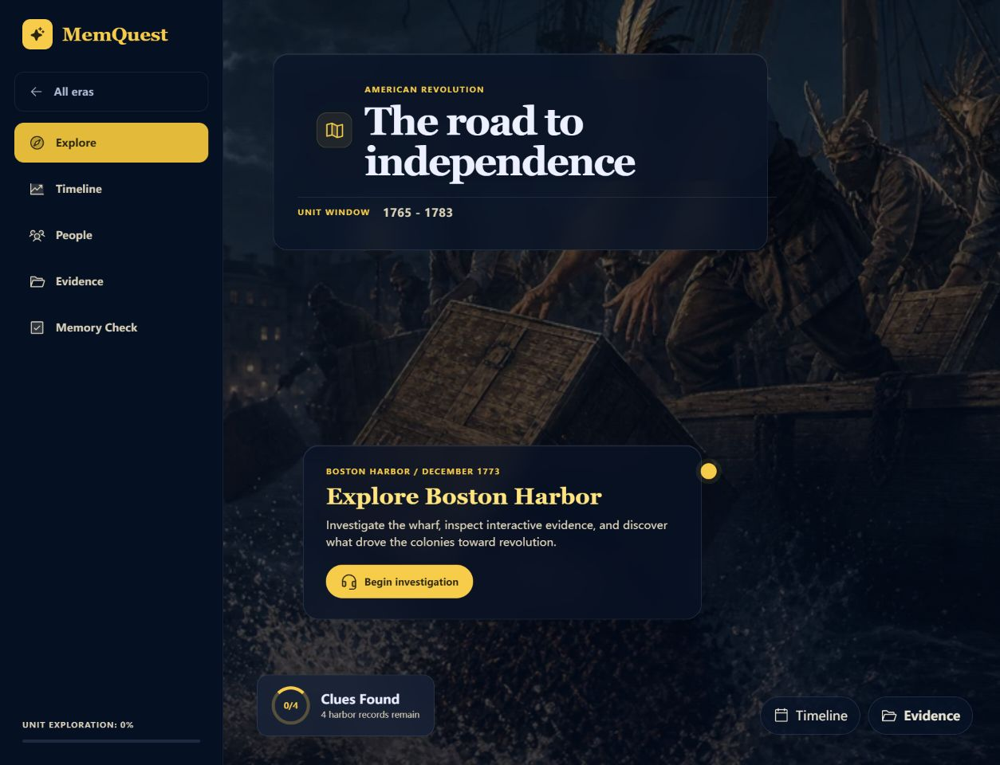
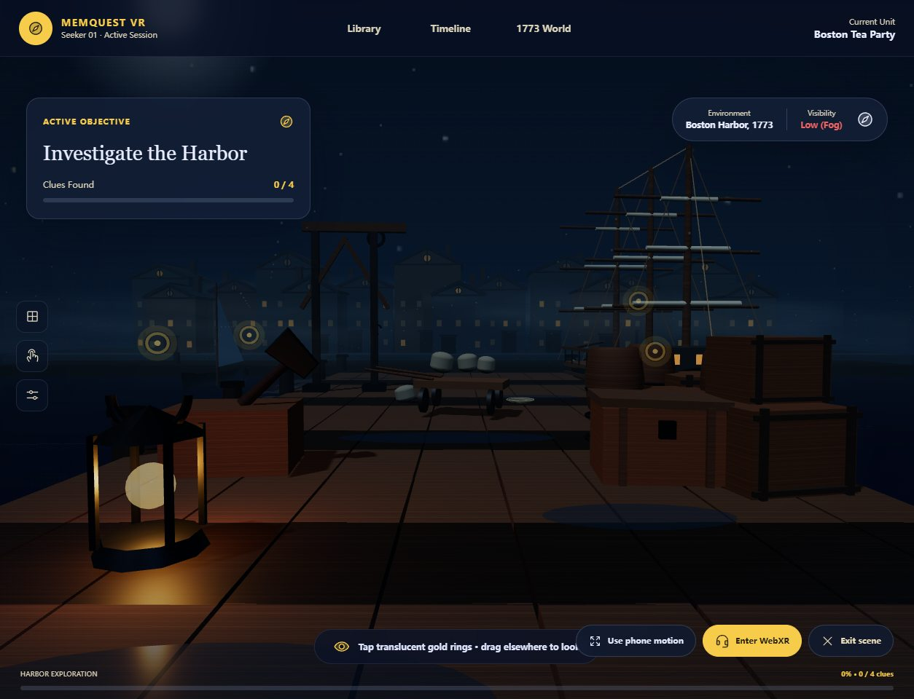
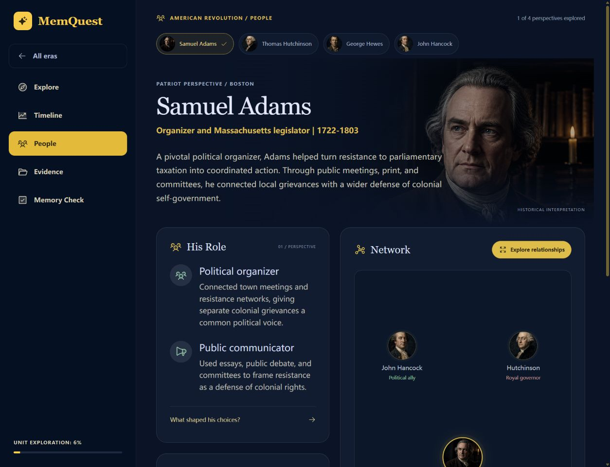
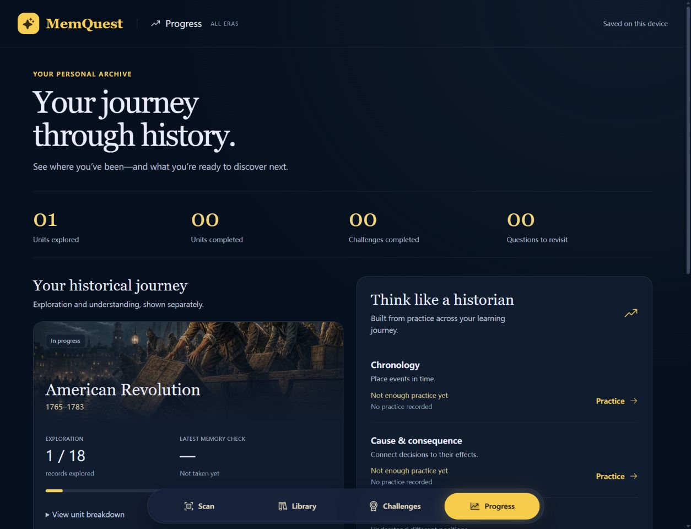

# MemQuest 新手交接指南

> 写给接手这个项目的人：你不需要先学会编程。第一步是把项目安全地打开，第二步是看懂它，第三步才是让 Codex 帮你做小步修改。
>
> 文档核对日期：2026-09-04。以 Windows + PowerShell 为主要路径。应用界面、语音保持英文；说明文档使用中文。

## 阅读路线

- **第一天**：读第 1–5 节，完成“打开项目 → 本地启动 → 做一个小修改”。
- **准备独立开发**：读第 6–10 节，学会提需求、检查结果、保存版本和部署。
- **准备作品集**：读第 11–13 节，整理设计证据、截图、叙事和素材来源。
- 不必背命令。遇到问题，带着报错、当前页面和目标询问 Codex。

**怎样阅读和转交：** 本文是 Markdown 文档。在 GitHub 中打开会自动排版；本机可用 VS Code 打开后按 `Ctrl+Shift+V` 预览，也可在 Codex 文件面板查看。单独转交文档时，请同时保留本文件和同级 `images` 文件夹，图片依靠相对路径显示；指向源码和 README 的链接则需要完整仓库。正式交接仍推荐通过已更新的 GitHub 仓库分享。

目录：[交接状态](#s1) · [先认识项目](#s2) · [环境与下载](#s3) · [启动](#s4) · [Git 工作流](#s5) · [Codex 协作](#s6) · [功能说明](#s7) · [文件地图](#s8) · [测试](#s9) · [部署](#s10) · [作品集](#s11) · [资料模板](#s12) · [交接清单](#s13) · [排错](#s14) · [官方资料](#s15)

<a id="s1"></a>
## 1. 交接前，先分清“哪一份是最新的”

### 1.1 项目信息卡

| 项目 | 当前信息 |
| --- | --- |
| 产品名 | MemQuest |
| GitHub 仓库 | [BigFranklin1/memquest-webmr-test](https://github.com/BigFranklin1/memquest-webmr-test) |
| 仓库权限 | 私有；没有访问权限时，链接可能显示 404 |
| 默认分支 | `main` |
| 当前电脑项目目录 | `E:\code\webxr-test`；这是原开发者的路径，不要求新电脑相同 |
| 线上体验地址 | [webxr-test-one.vercel.app](https://webxr-test-one.vercel.app/) |
| Vercel 项目名 | `webxr-test`；与 GitHub 仓库名不同是正常的 |
| 本地预览 | [localhost:4173](http://localhost:4173/)；只有这台电脑启动服务后才可用 |
| 核对时的本地 HEAD / origin/main | `dad8157`，Initial commit: MemQuest WebMR prototype |
| 核对时的生产部署 | `dpl_357E3AuvamL4BKPXgEevoTbp7kYR`，READY / production |
| 最近验证基线 | 54 项应用测试 + 4 项 Sites 测试；生产构建通过，仍有大分包警告 |

**重要：文档本身不能证明三个版本始终同步。** 每次交接前仍要分别核对本地 Git 状态、GitHub 的最新提交和 Vercel 当前生产部署，不能只看网页能否打开。

本文记录的是核对当时的快照。正式交接时，请在第 13 节填写**最终 commit 和部署地址**，不要长期把上面的旧编号当成最新版。

### 1.2 必须分别交接的东西

| 东西 | 怎样交接 | 不要这样做 |
| --- | --- | --- |
| 源代码 | GitHub 邀请 → 接手者接受 → clone 仓库 | 只发线上网址，或只发截图 |
| GitHub 写入权限 | 仓库所有者邀请接手者自己的账号 | 共用原作者密码 |
| 发布权限 | Vercel 项目/团队按当前套餐和权限规则授权，或约定仍由原作者发布 | 默认“能看网站”就“能部署” |
| Codex 使用权限 | 接手者用自己的受支持账号登录；核实可用功能与用量 | 把旧电脑登录态、密钥发给对方 |
| 设计过程 | 原型参考、研究笔记、Figma/Canva 源文件、迭代说明 | 以为这些都在 GitHub 中 |
| 媒体来源 | 图片原始文件、生成记录、音频脚本、来源与许可说明 | 把历史插画当作真实历史照片 |
| 历史对话 | 由原作者整理必要决定到文档 | 以为 clone 会带走全部 Codex 聊天记录 |

首次运行网站**不需要业务 API Key、数据库、HeyGen 登录或 Vercel 登录**。这些权限只在相应开发/发布工作需要时才配置。

<a id="s2"></a>
## 2. 先认识项目，不要先背代码

MemQuest 是一个可以在手机浏览器打开的历史学习交互原型。用户既能通过相机读到印刷英文中的历史线索，也能进入数字历史档案和 3D 港口场景，再通过挑战和反馈继续学习。

当前完整样例是 **The American Revolution**。其他时代卡片只是 Coming soon，不是已经开发好的内容。

### 2.1 最少需要认识的词

| 词 | 用日常语言理解 |
| --- | --- |
| 项目 / Repository / 仓库 | 一整套代码、图片、声音、配置和文档 |
| 前端 | 浏览器中你看见和操作的部分 |
| React | 把页面拆成可重复使用的小组件的工具 |
| Vite | 在本机预览项目，并把代码打包成可上线文件的工具 |
| Node.js | 让电脑能运行项目开发工具的环境；不是网页本身 |
| 依赖 / dependencies | 项目借用的其他工具包，不需要你逐个编写 |
| 终端 / PowerShell | 输入文字命令，让电脑执行操作的窗口 |
| 根目录 | 同时包含 `package.json`、`src`、`README.md` 的最外层项目文件夹 |
| 本地 / localhost | 当前这台电脑，不是互联网服务器 |
| Git | 在本机记录代码版本的工具 |
| GitHub | 在云端存放 Git 仓库并协作的平台 |
| 分支 / branch | 一个独立的修改方向，如 `feat/people-reading` |
| commit | 给一组改动建立一个有说明的版本存档 |
| push | 把已经 commit 的版本上传到 GitHub |
| pull | 获取并整合别人已经上传的版本 |
| PR / Pull Request | 请协作者检查并合并你的分支改动 |
| build | 生成用于发布的网站文件 |
| deploy | 把构建结果发布到托管平台 |
| OCR | 把相机画面中的文字读成文本，不等于理解所有实物 |
| WebXR | 浏览器接入支持设备的沉浸式 AR/VR 能力的接口 |
| localStorage | 当前浏览器为当前站点保存的一小份数据，不是云端账号 |



**记住这句话：保存文件，不等于 commit；commit，不等于 push；push，也不一定等于上线。**

### 2.2 这是网页，不是原生 App

- 不需要打包 APK，也不用先安装 Android Studio、Xcode、Docker 或数据库。
- 手机通过 HTTPS 链接访问。普通浏览器可以使用回退交互，沉浸式 XR 取决于设备和浏览器。
- 本项目没有登录、多人系统、云端学习记录或实时 AI 聊天后端。
- 开发时使用 Codex，不代表网站运行时调用了 Codex / OpenAI API。

<a id="s3"></a>
## 3. 新电脑第一次准备：账号、工具、代码

### 3.1 需要什么

| 工具或账号 | 是否必要 | 做什么 |
| --- | --- | --- |
| GitHub 账号和仓库邀请 | 必要 | 获取与提交代码 |
| GitHub Desktop | 推荐给新手 | 用图形界面 clone、创建分支、commit、push |
| Node.js 24.x | 必要 | 与本项目已验证的本地 / Vercel 主版本一致 |
| Codex 开发入口 | 使用 AI 继续开发时需要 | 读代码、修改、测试、解释错误 |
| Chrome 或 Edge | 推荐 | 本机调试网页 |
| iPhone Safari / Android Chrome | 手机验收需要 | 验证真实授权、旋转、触摸、音频 |
| VS Code | 可选但实用 | 看文件、改文字、预览 Markdown |
| Git for Windows | 使用 PowerShell Git 命令时需要 | 让终端识别 `git`；只用 Desktop 时不强求命令行 |
| Vercel 账号 / 项目权限 | 发布时才需要 | 部署与查看构建日志 |
| Figma、Canva 等排版工具 | 作品集阶段可选 | 整理图版与演示叙事 |

从官方入口安装：[Node.js](https://nodejs.org/en/download)、[GitHub Desktop](https://desktop.github.com/)、[Git for Windows](https://git-scm.com/download/win)、[VS Code](https://code.visualstudio.com/Download)。

Node.js 选择 **24.x**，安装时保留 npm 和加入 PATH 的选项。安装完成后重新打开终端；旧终端可能还不知道新软件的位置。本项目暂不要求你追新版本或升级依赖。

Codex 的安装入口与产品界面可能更新。本指南沿用项目中的“Codex”称呼；核对时官方旧 Codex app 链接已跳转到包含 Codex 工作流的桌面应用文档。请按官方 Windows 页面安装并在应用中选择支持本地项目的 Codex 工作方式，而不是把代码粘贴到一个没有项目文件访问能力的普通聊天里。[官方 Windows 说明](https://learn.chatgpt.com/docs/windows/windows-app)

### 3.2 用 GitHub Desktop 获取项目：推荐路线

1. 请原作者把你的 GitHub 用户名加入仓库协作者；你在自己的账号中接受邀请。
2. 分别登录 GitHub 网页和 GitHub Desktop。
3. 打开本项目的 GitHub 仓库页面。
4. 点击 **Code → Open with GitHub Desktop**。
5. 在 Desktop 中选择本机保存位置，确认最终项目路径。
6. 点击 **Clone**，等待结束。
7. 打开文件夹，确认能看到 `package.json`、`src` 和 `scripts`。

例如，你可以把最终项目目录选为：

```text
C:\Users\你的Windows用户名\Documents\GitHub\memquest-webmr-test
```

“你的Windows用户名”只是占位说明，**不能原样复制**。最稳妥的方法是用资源管理器打开项目文件夹，复制地址栏中的实际完整路径。避开 Program Files；尽量不放在会自动同步的云盘文件夹中。

这一步操作顺序依据 GitHub Desktop 官方说明；菜单文字随版本可能略有调整。[克隆官方说明](https://docs.github.com/en/desktop/adding-and-cloning-repositories/cloning-a-repository-from-github-to-github-desktop)

### 3.3 如果已经拿到一份文件夹

- 原电脑上的 `E:\code\webxr-test` 已经是仓库，不要在里面再次 clone 一层，也不要再 `git init`。
- 如果拿到的是 Download ZIP，它通常不包含 Git 历史和远程关联；适合临时看文件，不是推荐的持续协作方式。
- 如果 ZIP 或复制目录中还有未推送的新内容，先让交接人确认并保留，再决定怎样并入仓库，不能直接覆盖。
- `node_modules` 和 `dist` 在新 clone 中不存在是正常的，它们分别由安装和构建生成。

### 3.4 检查安装是否成功

打开 PowerShell，输入一行，按一次 Enter：

```powershell
node --version
```

预期输出类似 `v24.x.x`，具体补丁号可以不同。

如果准备用终端操作 Git，再执行：

```powershell
git --version
```

如果只用 Desktop，终端找不到 `git` 不代表 Desktop 中的 Git 功能不可用；需要 CLI 时再安装 Git for Windows。

<a id="s4"></a>
## 4. 启动项目：第一天只需要完成这一节

### 4.1 在正确的文件夹打开终端

在资源管理器进入**项目根目录**，使用“在终端中打开”；或者在 Codex / VS Code 打开项目的终端。

检查当前位置：

```powershell
Get-Location
Test-Path .\package.json
Test-Path .\scripts\project.ps1
```

后两行应返回 `True`。若是 `False`，先不要安装，说明目录不对。

需要切目录时，输入 `cd`，后面接**你实际的项目完整路径**，路径有空格要用引号。原电脑的示例是 `cd "E:\code\webxr-test"`，不是每个人都用这条路径。

### 4.2 首次安装依赖

```powershell
.\scripts\project.ps1 install
```

正常情况下会下载依赖并创建 `node_modules`。等待命令结束，看到终端重新出现输入提示符后，再执行下一步。第一次需要互联网，下载时间取决于网络。

这个项目专门提供了 Windows 启动器：它直接调用 Node 安装目录中的 npm 和项目里的 Vite，避开此前出现过的 Corepack / pnpx 系统目录权限问题。**不需要 `corepack enable`，不需要为运行项目授予系统级管理员权限。** 安装 Node 本身是否需要权限，由电脑管理策略决定。

技术边界：这个 install 路径使用 npm 且不生成 package-lock，适合本机快速启动；仓库的标准锁文件仍是 `pnpm-lock.yaml`。它不是严格的 pnpm 锁定安装。若需要完全复现锁定依赖，请让 Codex 在已配置的 pnpm 环境使用 `pnpm install --frozen-lockfile`，不要删除锁文件或自己混换包管理器。

### 4.3 启动开发服务

```powershell
.\scripts\project.ps1 dev
```

看到 Vite ready 和 Local 地址后，打开：

[http://localhost:4173/](http://localhost:4173/)

注意：

- 运行服务的终端不返回输入提示符是正常的，不是“卡住了”。
- 保持这个终端运行。浏览器关了可以重新打开，服务停了则打不开。
- 修改文件并保存后，开发页面通常自动更新。
- 要停止，在**运行该服务的终端**按 `Ctrl+C`。
- 测试或其他命令请开第二个终端，并确认它也在项目根目录。
- 不要双击 `index.html` 用 `file://` 打开，那不是正常运行方式。
- 能打开网页但相机没有设备，是设备问题；可先使用不需要相机的 Library。

如果已经在 Codex 中，你也可以直接说：

> 请检查这个项目的环境，用项目自带的 PowerShell 启动器运行它，并打开本地预览。先检查 4173 端口是否已有本项目的服务，不要重复启动，不要改系统全局设置。

### 4.4 每天回来怎么继续

1. 打开 Desktop，确认是正确仓库和分支。
2. 没有未提交改动时，Fetch origin；如果有更新，Pull origin。
3. 用 Codex 打开同一个项目目录。
4. 依赖没变，通常不必每天 install。依赖清单/锁文件有变化，再按项目方式重新安装。
5. 启动 dev，打开本地预览。
6. 开始一个有边界的小任务，而不是同时让多个任务修改同一份文件。

### 4.5 手机为什么不能直接打开电脑的 localhost

手机的 `localhost` 指手机自己，不是你的电脑。电脑提供的 `http://192.168.x.x:4173` 之类局域网地址，即使手机能访问，也**不能当作可靠的摄像头 / XR 验收环境**。

手机正式测试使用 HTTPS 预览部署或生产部署。手机与电脑上的 localStorage 也不是同一份记录。摄像头 API 的安全上下文限制见 [MDN 官方说明](https://developer.mozilla.org/en-US/docs/Web/API/MediaDevices/getUserMedia)。

<a id="s5"></a>
## 5. Git：让你敢于修改，而不是背一套命令

### 5.1 推荐的图形界面工作流

以“优化 People 的手机阅读间距”为例：

1. 在 Desktop 选择本项目，先看 **Changes**。若已有改动，先弄清归属，不要丢弃。
2. 确认 `main` 是最新且工作目录干净。
3. 创建新分支，例如 `feat/people-mobile-reading`。这个名字是示例，不是必须已经存在的分支。
4. 用 Codex 做这一件事。
5. 在本地试用，运行第 9 节的测试。
6. 回到 Desktop 查看每个文件的差异。红色通常代表删掉，绿色通常代表新增。
7. 确认没有私密内容、临时文件和无关改动，填写明确的 Summary。
8. **Commit to 当前分支**：保存到本机历史。
9. **Publish branch** 或 **Push origin**：上传到 GitHub。
10. 创建 PR，请原作者或协作者审核；通过后才合并到 main。
11. 是否更新线上，仍要检查 Vercel 集成和部署结果。

GitHub Desktop 的提交、push 与 PR 是分开的操作。[Push 官方说明](https://docs.github.com/en/desktop/making-changes-in-a-branch/pushing-changes-to-github-from-github-desktop) · [PR 官方说明](https://docs.github.com/en/desktop/working-with-your-remote-repository-on-github-or-github-enterprise/creating-an-issue-or-pull-request-from-github-desktop)

好的提交说明：`Improve People spacing on mobile landscape`。不够明确的说明：`update`、`final`、`final-final`。

### 5.2 可以交给 Codex 的 Git 请求

检查，不修改：

> 请只检查 Git 状态：我在哪个目录和分支？有哪些未提交文件？远程仓库是什么？有没有可能覆盖别人的改动？用新手能理解的方式解释，暂时不要提交、推送、合并或部署。

准备一次提交：

> 请检查这次 People 手机阅读优化的改动和测试结果，只把与本次任务相关且确认应交付的文件建立本地 commit，提交说明为 Improve People mobile reading。先排除密钥、生成目录、临时截图和他人的未完成改动；不要 push 或部署。

随后你可以单独授权 push 和创建 PR。这是把“生成内容”和“对外发布”分开检查的好习惯。

### 5.3 只读命令速查：不会修改代码

已安装 Git 命令行时，在项目根目录使用：

```powershell
git status --short --branch
git remote -v
git log -5 --oneline
git diff --stat
```

含义依次是：看分支和文件改动、看远程仓库、看最近五个版本、看修改规模。分享输出前仍要检查是否包含不该公开的信息。

### 5.4 出现冲突或做坏了怎么办

- **未提交的改动**：先保存现状，向 Codex 指明“只撤回哪一次修改”。Discard changes 会丢掉相应未提交内容，不能当成普通关闭按钮。
- **已经提交但未上传**：让 Codex解释可恢复方案；不要自己照抄重置命令。
- **已经 push / 合并**：通常用新的修复提交或 revert 撤销错误，保留协作历史；不要 force push 改写大家共享的历史。
- **线上出问题**：Vercel 回滚只处理网站版本，代码仓库还需要相应修复，否则下次部署会把错误带回来。
- **merge conflict**：说明两边改到了冲突位置。先停下来，告诉 Codex 你要保留的功能，让它逐处解释，不要随便全选“当前”或“传入”。

不理解时不要执行 `git reset --hard`、`git clean -fd`、`git push --force`，也不要删除 `.git`。这些都不是新手的“刷新”方法。

<a id="s6"></a>
## 6. 用 Codex 继续开发：你负责设计判断，它协助实现

### 6.1 第一次打开项目

1. 登录自己的受支持账号，按应用显示的方式选择 Codex。
2. 添加/打开**本地项目文件夹**，不要只打开某一张截图或某一个 JSX 文件。
3. 对于第一次接手，推荐先在自己的功能分支中，使用明确的 **Local / 当前项目目录** 进行单任务修改。
4. 让 Codex 读 `AGENTS.md`、`README.md` 和本文档，并报告工作目录、Git 分支。
5. 请它启动项目并打开预览，确认你看到的是它正在修改的那一份文件。

应用当前支持选择项目或文件夹作为工作位置；具体入口名称以你的版本为准。[桌面上手官方说明](https://learn.chatgpt.com/docs/app)

第一次可以复制：

```text
我是刚接手 MemQuest 的 HCI 学生，编程经验很少。
请先阅读 AGENTS.md、README.md 和 docs/HANDOFF.zh-CN.md。
先不改代码，告诉我：
1. 当前工作目录、分支、未提交改动是什么；
2. 本地、GitHub、Vercel 哪些内容已经同步，哪些不能确认；
3. 如何运行当前项目，并请你实际运行和打开预览；
4. 当前哪些功能可用，哪些只是预设或未来计划。
不要自动升级依赖，不要提交、推送、部署，也不要删除任何旧改动。
```

### 6.2 Local 和 Worktree 为什么容易让人迷路

Local 是你选中的本地工作目录；Worktree 是 Git 的另一份工作副本，用于隔离不同任务。**它们不保证共用同一份正在运行的页面、依赖或未提交文件。**

如果 Codex 说“改好了”，你却看不到：

1. 问它正在修改哪个绝对路径、哪个分支。
2. 问当前 4173 服务从哪个目录启动。
3. 确认它是否在 Worktree，而你浏览的是 Local。
4. 再决定在那份目录重新启动服务，或者通过受支持的 Handoff / 分支合并流程带回改动。

不要靠复制粘贴整个文件夹解决这个问题。新手阶段不必同时开多个 Worktree。[Worktree 官方说明](https://learn.chatgpt.com/docs/environments/git-worktrees)

### 6.3 一个好需求应该有六件事

- **在哪里**：Library → American Revolution → People。
- **什么问题**：横屏时人物介绍太密，第一屏看不到关系图入口。
- **希望怎样**：减少留白、缩短介绍展示长度，保留完整内容入口。
- **不能变什么**：英文文案、现有关系链接、进度保存、其他页面。
- **怎样验收**：390×844、844×390，文字不遮挡，按钮可触达。
- **权限边界**：先本地修改和测试，不自动 push、部署。

可复制的视觉修改模板：

```text
目标页面：Library > American Revolution > People。
问题：在我附的手机横屏截图里，[指出具体位置与问题]。
请保留现有档案风格、英文内容和所有关系跳转。
只优化布局；不要改变历史事件数据、评分或存档规则。
请先说明修改范围，再实现，在 390×844、844×390、1254×960 检查，
提供前后对比、修改文件及测试结果。不要部署或推送。
```

### 6.4 报错时怎样描述

不要只说“不能用”。复制下面的结构：

```text
我执行的命令：[原命令]
我所在的目录：[Get-Location 的结果]
设备/浏览器：[例如 Windows Edge / iPhone Safari]
完整错误：[从第一行 Error 开始的相关内容，先删掉密钥]
复现步骤：[打开哪里 → 点击什么 → 出现什么]
预期：[应该发生什么]
实际：[发生了什么，附截图]
请先解释原因并提出最小修复，不要关闭安全限制、删除锁文件或重装所有环境。
```

### 6.5 怎样看懂 Codex 的交付

让它在结束时回答：

1. 改了什么行为，为什么？
2. 修改了哪些文件？有没有动到存档、评分、权限或媒体？
3. 测试命令是什么，结果是什么？
4. 哪些用真机验证了，哪些只是模拟测试？
5. 哪些没有做？有没有剩余风险？
6. 有没有 commit / push / deploy？对应版本号是什么？

看到“测试通过”之后仍要亲自点一遍关键流程。AI 写出的可运行代码不自动等于好的人机交互，也不证明用户学习效果。

### 6.6 AGENTS.md、Skills、插件分别是什么

- `AGENTS.md`：这个仓库给 AI 的长期协作约定。稳定的产品决定写进去，避免下次被改回去。Codex 会按所在目录读取对应指引。[官方 AGENTS.md 说明](https://learn.chatgpt.com/docs/agent-configuration/agents-md)
- **Skill**：特定任务的做法说明，例如界面审美、Three.js 或文档整理。
- **插件/连接器**：让 Codex 按权限使用浏览器、GitHub、Vercel、媒体服务等工具。
- **个人设置**：旧电脑里的 Skills、插件安装和登录态不会随 Git 仓库自动复制。

本项目此前使用过 `design-taste-frontend` 等设计指引。新电脑如果没有同名 Skill，请让原作者提供允许分享的版本，或让 Codex按仓库里的设计决定继续，不要假装已使用不存在的工具。纯粹运行网站不依赖这些 Skill。

### 6.7 安全底线

- 保留沙箱和逐项授权，不要为了省事常驻 Full access。
- 授权前问清：操作哪个目录、连哪个服务、读什么、写什么、是否发布、能否撤回。
- API Key、Token、`.env.local`、账号密码不贴到作品集、不放进前端源码、不提交 GitHub。
- Codex、GitHub、Vercel、HeyGen 的账号和费用是不同的，不要假设一个登录覆盖全部。
- 新增收费服务、云数据库、上传相机画面、实时语音或分析埋点，必须单独讨论隐私、权限与预算。
- 本项目当前不需要关闭 TLS 检查、放开麦克风权限或上传相机帧。

<a id="s7"></a>
## 7. 功能说明：用户能做什么，不能做什么

### 7.1 全局与单元内导航不是同一层

```text
MemQuest
├─ Scan：相机文字 → 事件结果 → 人物 / 时间线
├─ Library：时代首页
│  └─ American Revolution：当前完整单元
│     ├─ Explore：概览 → Boston Harbor 1773
│     ├─ Timeline：事件和因果联系
│     ├─ People：人物立场与关系
│     ├─ Evidence：线索与证据限制
│     └─ Memory Check：单元练习
├─ Challenges：跨时代的全局任务目录
└─ Progress：跨时代的全局学习记录
```

Challenges / Progress 的结构面向所有历史时代；目前只有美国革命有可用内容。不要为了新增一个时代，又复制出一套“美国革命专属全局导航”。



图 1：本地真实应用截图，初始探索为 0%。其他时代明确标记 Coming soon。

### 7.2 Scan：对文字进行事件匹配

**用户流程：** 点击 Scan → 允许后置相机 → 把印刷英文放进框里 → 等待稳定与识别 → 显示结果或明确失败 → 重试/继续学习。

扫描时，相机占据整个视口；大面积说明、品牌栏和导航会暂时隐藏。仅保留退出按钮、透明取景框和边缘进度。结果出现后恢复轻量操作界面，同时继续显示相机：中央透明 Three.js 场景展示导入的 Samuel Adams 人物模型，并循环播放说话手势，并用一次短暂粒子效果表现生成过程，周围悬浮事件资料、语音、时间线、人物和再次扫描按钮。默认是原有屏幕空间投影；只有 Boston Tea Party 结果提供默认关闭的 `Page anchor` 测试开关。

| 可匹配事件 | 年份 | 内部 ID（开发时使用） |
| --- | --- | --- |
| Stamp Act | 1765 | `stamp-act` |
| Boston Massacre | 1770 | `massacre` |
| Boston Tea Party | 1773 | `tea-party` |
| First Continental Congress | 1774 | `congress` |

- Tesseract.js 在浏览器 Worker 中识别；英文模型、Worker 与 WASM 随站点提供。
- 每 450ms 检查画面稳定性，约 8 秒仍不稳定时允许一次尝试。不是每 450ms 都跑一次完整 OCR。
- OCR 串行执行，每轮未命中后约 1.2 秒再试，最多三轮。
- 实际裁切与屏幕中的取景框对应；横竖屏切换时重新计算。
- 评分要求命中标题或事件专属短语，只有年份不能匹配。
- 命中结果默认把 Samuel Adams 人物投影到最后一次取景框对应的屏幕区域；人物可点击并显示识别文字摘要。周围卡片展示事件、日期和匹配分数，可以听故事、进入对应时间线、关联 Samuel Adams 或再次扫描。
- Boston Tea Party 的 `Page anchor` 开关打开后才加载本地图片追踪。参考图是 `src/assets/tracking/boston-tea-party-cover.png`，编译数据是同目录的 `.mind` 文件。保持完整封面在画面内时，人物随封面移动和转动；失去封面后模型隐藏，关掉开关即可回到默认投影。 更换参考图后，从项目根目录运行 `.\scripts\project.ps1 compile:tracking`，再重新构建。
- 无匹配与 OCR 不可用是两种不同失败状态；拒绝相机权限又是另一种情况，均需保留恢复入口。
- Exit scan 关闭相机与 OCR。页面隐藏时暂停，回来可 Resume。
- 相机帧、识别文本不上传、不保存为学习记录。不等于整个网站“无需网络”：首次加载应用、模型和音频仍需要网络，未实现完整离线 PWA。



图 2：390×844 浏览器视口中的实际扫描 UI；背景来自明确标注的模拟相机测试页，不是真机实拍。右侧 QA 是测试工具，不属于生产界面。



图 2A：844×390 模拟相机测试页中的默认命中状态。Samuel Adams 模型、循环动画与悬浮卡片使用实际组件；背景是参考封面，不是真实摄像头拍摄。



图 2B：开发夹具中的 `Page anchor` 开关状态。背景是用户提供的参考封面，不是真实摄像头；人物模型、粒子和 UI 是实际组件，追踪姿态在此截图中由测试夹具稳定注入。真机仍需要用同一封面另行验证。

**不能宣称：** 能识别人脸、任意物体、中文手写、任意历史事件，或者已经实现持久的现实世界锚点。当前 Scan 是英文文字 → 四个预设事件的匹配；图片追踪只支持 Boston Tea Party 这一个参考封面，属于当前页面会话内的实验开关，不是平面检测或 WebXR Anchors。

### 7.3 语音与人物互动

当前声音是 **HeyGen 预生成英文音频文件**，不是用户每点一次按钮就请求 HeyGen API。

- Scan：人物介绍 1 段、预设问答 3 段、事件故事 4 段。
- Harbor：四个线索各 1 段故事。
- 现有目录共 12 段 WAV。使用成熟、严肃的 Norman 声线方向。
- 用户点击问题按钮后播放现成回答；没有开放式问答。
- 网站不录麦克风，不用浏览器语音合成；Vercel 权限策略禁用麦克风。
- 当前的历史人物声音是创作性演绎，不能描述成“本人真实声音”。

修改声音要同时检查：英文脚本、史实、发音、声线、文件大小、组件中的资源引用。只改屏幕文字不会自动修改音频里的内容。

### 7.4 Library → Explore

单元概览介绍时代范围，引导进入港口，并能转到 Timeline、People、Evidence、Memory Check。这里是“进入学习单元”的页面，不是全局首页。



图 3：左侧是单元内导航；All eras 返回上一级。布局在手机上会重排，不必照搬桌面侧栏。

### 7.5 Boston Harbor 1773：真正可转动的 3D 场景

场景用 Three.js 程序化建立，有带结构梁与系泊桩的湿木栈桥、分段船体、索具与卷帆、动态水面、六面体夜空天空盒、会缓慢移动的分层低雾、装卸设施、货物和错落山墙仓库。仓库不是简单方盒，屋顶、山墙和烟囱高度分别计算，避免烟囱穿过三角立面。环境装饰不可交互，仍只有四条学习线索。它不是一张作为背景的港口图片，也不是对真实港口的考古级复原。

四个可交互物件对应四条历史线索：

| 物件 | 学习上的作用 |
| --- | --- |
| 遮光提灯 | 夜间行动与组织 |
| 东印度公司茶箱 | 被针对的茶货与税收争议 |
| Dartmouth 茶船 | 航运、通关期限和冲突情境 |
| 船木匠手斧 | 打开茶箱的工具与行动方式 |

- 半透明金色提示指示可交互物件；点击范围做了容错。
- 拖动是转动视角，不应被误判为点击。
- 选中物件后，在物件附近出现小卡片。
- Listen to the story 播放该物件的故事。
- Why it matters 在原位置展开更深的解释和相关历史。
- 切换、关闭卡片或退出场景会停音频；不要让不同故事重叠。
- 支持设备可尝试 Enter WebXR；普通手机可启用 Use phone motion；不支持时仍可拖动查看。



图 4：桌面浏览器的实际 3D 渲染截图，不是头显双目截图。光线与物件精细度仍属于原型阶段。

### 7.6 三种“相机 / XR”不能混为一谈

| 位置 | 当前方式 | 演示时怎样说 |
| --- | --- | --- |
| 最初 Enable AR Camera | 支持时尝试 immersive-ar + DOM Overlay，否则相机回退 | 相机 / AR 引导原型 |
| Scan | 始终使用普通 getUserMedia 相机，便于 OCR 读取帧 | 本地英文文字识别；命中后可选单一封面图片追踪 |
| Harbor | 支持时 immersive-vr；否则方向传感器 / 拖动 | 可交互 3D 场景，提供设备适配 |

手机能随着转动改变视角，不自动说明已经进入 WebXR；它也可能是设备方向传感器模式。Scan 成功本身不说明实现了空间定位；只有用户主动打开 Boston Tea Party 的 `Page anchor` 才运行单一参考图追踪，而且仍不等于平面检测、持久空间锚点或任意物体追踪。

### 7.7 Timeline、People、Evidence、Memory Check

| 页面 | 核心操作 | 继续开发时的重点 |
| --- | --- | --- |
| Timeline | 四张带图事件卡；手机水平滑动；选中事件后看细节和因果 | 图片、日期、叙事与选中状态同步，保留跨链接上下文 |
| People | 四个人物视角切换，人物简介、角色、事件、关系图 | 区分盟友、对手、情境联系；不能把“共同背景”写成“确实认识” |
| Evidence | 查看物件、报道、法律和记录；看支持什么与不能证明什么 | 有些场景证据需要先发现；锁定时不能计为已学习 |
| Memory Check | 五道单元练习题、提交、反馈、关联复习、重试 | 不完整不能随意计分，重试不制造重复成就 |

People 的当前人物是 Samuel Adams、Thomas Hutchinson、George Hewes、John Hancock。人物数据与 Scan 中以 Samuel Adams 为主的预设问答不是同一个功能范围。



图 5：实际档案界面。肖像属于 Historical interpretation。人物视角、关系和事件是内容的三个层次，不是三张只为装饰的卡片。

### 7.8 全局 Challenges 和 Progress

Challenges 当前有四类任务：港口调查、事件排序、人物视角、证据推理。可以按时代、技能和完成状态筛选；跳到资料页再返回时，应保留挑战进度、答案和排序。

Progress 把**看过什么**与**答得怎样**分开：

- 记录单元探索、已完成挑战、近期活动、里程碑和待复习问题。
- 学习反馈有时间顺序、因果、人物视角、证据推理四类。
- 最近 100 次练习中，每道不同题目使用最新答案；四个事件的排序整体是一道题。
- 至少三道不同题目的结果，才显示该能力的正确率；不足时明确提示。
- 美国革命目前有 18 条内容记录；完成全部探索且 Memory Check 至少 80% 才获得单元完成标记。
- 已获得完成标记不会因后续较低分被撤销；重试同一挑战不重复计数。
- 尚未上线的时代不进入统计总数。
- 不把浏览量写成知识掌握率，不显示“学会全部历史的百分比”。



图 6：隔离测试会话中的页面；示例里仅浏览过一位人物，所以显示 1/18。这里不是研究参与者的数据，也不是产品使用量证明。

### 7.9 存档和隐私

- 新存档键：`memquest.learning.v1`，数据在当前浏览器、当前站点来源的 localStorage 中。
- 保留单元记录、草稿、最多 100 次练习和 80 条活动。
- 旧键 `memquest.american-revolution.v2` 保留，用户可主动检查后导入旧探索；旧演示数据和成绩不应伪装成新学习结果。
- 本地 localhost、局域网地址、Vercel 主域名和预览域名的存档通常彼此分开。
- 更换手机、浏览器、清除站点数据，不会自动找回原存档。无云同步。
- 截图或研究演示使用隔离测试页，不要随意清空真实使用者的浏览器数据。

<a id="s8"></a>
## 8. 文件地图：改什么，先找哪里

你不必读完整个仓库。先根据目标找到对应的区域，再让 Codex说明关联影响。

| 想做什么 | 主要位置 | 注意 |
| --- | --- | --- |
| 全局导航、切换 Scan、相机占用 | `src/App.jsx` | 会影响所有入口 |
| 相机授权、XR 回退、资源关闭 | `src/experience.js` | 必须测拒绝、退出、延迟授权 |
| Scan 结果、问答、时间线 UI | `src/ScanExperience.jsx` | 与人物单元页不是同一个组件 |
| 扫描中的透明 UI | `src/scan-capture.css` | 横竖屏、安全区、取景框裁切 |
| OCR 事件预设与数据 | `src/scanData.js` | 事件 ID 需要对应学习数据 |
| 匹配评分 | `src/scanMatcher.js` | 防止年份、宽泛词误命中 |
| OCR 加载与稳定帧识别 | `src/ocrRuntime.js`、`src/ocrScanner.js` | 不并发、不上传、退出终止 |
| Scan 阶段 | `src/scanState.js` | 新状态要加测试 |
| Library 首页 / 单元外壳 | `src/LibraryExperience.jsx` | 全局入口与单元入口的层级 |
| 单元时间线、证据、练习 | `src/RevolutionUnit.jsx`、`src/revolutionData.js` | 跨链接和题目关联 |
| People 档案 | `src/PeopleView.jsx`、`src/peopleProfiles.js`、`src/people.css` | 图像、关系类别、手机堆叠 |
| 港口场景和物件点击 | `src/HarborScene.jsx` | 场景位置、命中范围、性能、音频释放 |
| 时代目录、场景线索文字 | `src/libraryData.js` | 物件含义与 UI 对应 |
| 单元记录 | `src/libraryState.js` | 导入兼容与唯一记录 |
| Challenges / Progress | `src/GlobalWorkspace.jsx`、`src/global.css` | 面向全部时代，不要写死为单元页 |
| 全局目录、挑战、能力 | `src/learningData.js` | 新时代、新挑战要配置真实内容 |
| 全局存档和统计 | `src/learningState.js` | 改动风险高，不能丢旧数据 |
| 共享视觉 | `src/styles.css`、`src/archive-refresh.css` | 选择器可能同时影响多页 |
| 图片和声音 | `src/assets/` | 避免只改文件名而忘了 import |
| Windows 启动 | `scripts/project.ps1` | 不要恢复全局 Corepack 依赖 |
| Vite 打包 | `vite.config.mjs` | 产物是 dist/client |
| Vercel 权限与构建 | `vercel.json` | 禁止误开麦克风 |
| AI 约定 / 总览 / 验收 | `AGENTS.md`、`README.md`、`design-qa.md` | 改功能后同步必要文档 |

### 8.1 文件后缀的意思

- `.jsx`：React 界面和交互；不是图片。
- `.js` / `.mjs`：逻辑、数据或工具脚本。
- `.css`：颜色、字体、间距、布局和响应式规则。
- `.json` / `.yaml`：配置和数据，标点结构严格。
- `.md`：Markdown 文档；GitHub 可以直接排版阅读。
- `.webp` / `.png` / `.jpg`：图片；`.wav`：现有音频。

### 8.2 哪些不要手改或提交

- `node_modules/`：下载的依赖，不手改、不提交。
- `dist/`：构建产物，不拿它代替源代码来改页面。
- `.git/`：版本历史，不删、不手改。
- `.vercel/`：当前电脑的平台关联，已忽略，不通过复制它来转交账号权限。
- `.env*`：环境信息，已忽略；不要上传或公开。
- `pnpm-lock.yaml`：依赖锁文件，应保留；改依赖必须有理由并同步锁文件。
- 根目录 `qa-*.png` 和 `*.log` 被忽略。正式要分享的截图应整理到 `docs/images/` 等明确位置。

以下四个文件是 Sites 托管兼容层，**不是当前 Vercel 业务后端**，一般界面迭代不要动：

```text
.openai/hosting.json
worker/index.js
scripts/prepare-sites-build.mjs
tests/sites-worker.test.mjs
```

### 8.3 新手适合先做的任务

1. 修正一段已经审核过的英文说明。
2. 调整一个页面的手机间距与按钮可读性。
3. 更换一张有来源记录的图片，保留文件引用和可读性。
4. 为已有交互补空状态、错误说明或无障碍标签。
5. 补充真实测试记录、截图和作品集注释。

相机生命周期、评分、存档迁移、增加时代、实时对话后端属于更高风险任务，先规划，再做。尤其不要只把 Coming soon 按钮解锁就当成“新单元已完成”。

<a id="s9"></a>
## 9. 每次修改后的验收：不只看首页

### 9.1 固定的三步检查

在第二个 PowerShell 终端、项目根目录执行；**上一条失败时先处理，不要继续宣布通过**：

```powershell
.\scripts\project.ps1 test
.\scripts\project.ps1 build
.\scripts\project.ps1 test:sites
```

| 检查 | 主要看什么 | 不能证明什么 |
| --- | --- | --- |
| test | 状态、匹配、资源释放、学习图、统计规则 | 所有手机的真实画面和权限 |
| build | 能否生成正式部署产物 | 网站已经发布 |
| test:sites | 静态资源、路由回退、Sites 产物 | 用户会觉得好用或学习有效 |

交接基线为 54 + 4 项测试。以后新增测试，数量改变正常；重点是没有失败，并有对应功能覆盖。

构建后应有 `dist/client/index.html`、`dist/server/index.js`、`dist/.openai/hosting.json`。大 JavaScript 分包警告目前存在，属于后续性能工作，不代表可以忽略真正的 build error。

### 9.2 在没有相机或不想污染存档时

本地 dev 服务运行后可以打开：

| 地址路径 | 用途 |
| --- | --- |
| `/tests/global-browser-fixture.html` | 真实应用 + 内存存档，适合挑战、进度、资料页测试 |
| `/tests/harbor-browser-fixture.html` | 直接渲染真实 HarborScene，适合视觉、横屏和 WebGL 性能复核；不写学习记录 |
| `/tests/scan-camera-browser-fixture.html` | 模拟视频 + 真正的相机控制/裁切/状态 UI；QA 控制不同结果 |
| `/tests/ocr-browser-fixture.html` | 测试画布上的英文能否被真实本地 OCR 识别 |

Scan 测试页的 QA 操作：

- `hold`：让模拟识别停在处理中，方便观察布局。
- `match`：模拟命中；`unmatched`：模拟多轮无匹配；`error`：模拟识别异常。
- `Permission: allowed/denied`：下一次启动时允许/拒绝模拟相机。
- `Use real OCR`：改用真实 Tesseract 识别**模拟视频中的文字**，仍不等于真实摄像头测试。

这些是开发测试页面，不作为生产功能发布。不用把测试页中的 QA 控件、模拟背景或示例分数伪装成真实使用情况。

### 9.3 每轮的人工检查表

| 场景 | 最低验收 |
| --- | --- |
| 390×844 竖屏 | 导航不挡按钮，文字可读，Scan 画面可见 |
| 844×390 横屏 | 无横向溢出，底部安全区留足，卡片可滚动 |
| 1254×960 桌面/平板 | 大屏层级合理，不仅是手机界面的放大 |
| Scan | 同意/拒绝授权、匹配/不匹配、重试、退出 |
| 相机暂停 | 切到其他应用再回来，允许用户恢复，不偷偷持续拍摄 |
| Library | Home → Explore → 场景 → 返回 |
| 场景 | 点物件有效；拖动不误触；展开/关闭；音频不重叠 |
| Timeline / People | 选中内容与跳转目标一致 |
| Evidence | 锁定状态与发现条件合理 |
| Memory Check | 未完成不可提交；反馈和重试正确 |
| Challenges | 从任务去资料再回来，草稿不丢 |
| Progress | 初始不预填；重复查看不重复加分 |
| 声音 | 手机真实点击后可播放；切换/退出能停 |
| 浏览器控制台 | 没有新异常或找不到资源的错误 |

正式演示前，在 Android Chrome、iPhone Safari 的 HTTPS 页面各走一遍。记录型号、浏览器版本、方向、commit 和部署地址。没有测试过的设备要写“未验证”，不要用模拟器结果替代真机结论。

<a id="s10"></a>
## 10. 发布到 Vercel：把“我电脑上好了”变成“别人可以访问”

### 10.1 当前项目配置

| 配置 | 当前值 |
| --- | --- |
| Vercel 项目 | webxr-test |
| Framework | Vite |
| Node 主版本 | 24.x |
| Build command | `pnpm run build` |
| Output directory | `dist/client` |
| 根目录 | 仓库根目录，即有 package.json 的位置 |
| Camera / XR | 同源允许 |
| Microphone | 禁用 |
| 业务 API 密钥 | 当前运行不需要 |

线上配置与 `vercel.json` 要保持一致。不要把输出目录写成 `src` 或只写 `dist`。

### 10.2 先确认发布方式

Vercel 支持与 Git 仓库关联后，在 push / 合并到生产分支时自动创建相应部署，但需要连接、权限和构建全部成立。[Vercel Git 部署官方说明](https://vercel.com/docs/git)

**本次交接检查确认了项目和生产部署存在，没有确认自动 Git 集成已配置完成。** 所以不要认定 push 一定更新网站。

建议由原作者带接手者在现有项目中确认：

1. Git 连接是否指向 `BigFranklin1/memquest-webmr-test`。
2. 生产分支是否为 main。
3. 谁可以部署，提交作者是否满足平台权限条件。
4. Build / Output / Node 配置是否如上。
5. 是否可以先获得 Preview 地址再发布 Production。

如果未连接，不要直接创建一堆同名项目；先决定是把现有项目连接到 GitHub，还是暂由已有权限的原作者发布。私有仓库、团队成员和套餐可能影响部署，权限不足要找所有者处理，不要为了通过发布把仓库改成公开。

### 10.3 推荐发布顺序

1. 本地测试、构建、真机预览检查。
2. 检查 Git 差异，确认提交中没有私密文件。
3. commit 并 push 功能分支，建立 PR。
4. 如已配置 Git 集成，检查 Preview 部署；否则让有权限的人部署预览。
5. 用预览 HTTPS 地址在手机测试。
6. 审核后合并 main，按实际发布流程更新 Production。
7. 在 Vercel 检查 READY、部署来源与 commit。
8. 打开主域名，亲自确认最新交互，不只看部署按钮有没有成功。
9. 记录部署 URL、commit、日期和测试结果。

**Preview 与 Production 是两回事。** 一个新预览网址可用，不代表旧主域名已经换成它。不同域名的本地学习存档也可能不同。

### 10.4 让 Codex 协助发布的模板

先检查：

```text
请只检查这个项目的 GitHub 与 Vercel 配置：
目标仓库 BigFranklin1/memquest-webmr-test，现有 Vercel 项目 webxr-test。
告诉我当前代码是否已提交推送、Git 自动部署是否配置、
生产分支和最新部署是什么。不要读取或输出密钥，不要修改配置或部署。
```

确认后再发布：

```text
我已确认要发布的 commit 是 [填入审核过的 SHA]。
请先确认没有漏掉这次修改，执行应用测试、生产构建和 Sites 测试。
部署到现有 Vercel 项目的预览环境，不新建项目、不改域名、不增加收费服务。
完成后提供 HTTPS 地址、对应版本和手机验收清单。
生产环境先不要更新，等我确认。
```

括号中的 SHA 必须替换为实际审核的版本。若接手者没有 Vercel 权限，Codex 不能凭“原作者以前连接过”自动获得它。

### 10.5 发布失败不要乱改什么

先读 Build Logs，判断是依赖、路径、编译、权限还是网络错误。不要把“升级全部依赖”“删除锁文件”“关闭权限保护”当作默认修复。回滚旧部署前也要说明目标与影响，并同步修复代码。

<a id="s11"></a>
## 11. 把项目整理成 HCI 作品集

### 11.1 作品集不等于网页截图合集

代码交接回答“怎么继续做”；作品集回答“为什么这样做、做了什么取舍、凭什么认为更好”。

可以把这个项目的核心问题写成**待验证的设计命题**：

> 如何让移动端历史学习者在观察现实材料、探索历史情境与理解证据之间自然切换，而不被界面遮挡、设备限制或过度游戏化的进度指标干扰？

这是一种叙事建议，不是已经通过用户研究证实的结论。如果没有访谈或测试数据，请写“设计假设”，不能写“研究发现”。

### 11.2 建议的 8–10 页叙事结构

以下是排版起点，不是必须照搬的模板。篇幅有限时合并相邻页。

| 页 / 板块 | 回答的问题 | 建议呈现的证据 |
| --- | --- | --- |
| 1. 项目封面 | 这是什么，为谁做？ | 一句价值主张、代表性真实界面、原型阶段、个人职责与时间 |
| 2. 问题与约束 | 为什么不是普通历史列表？ | 目标使用情境、设计假设、手机相机 / XR / 屏幕尺寸限制 |
| 3. 信息架构 | 全局与单元内容如何组织？ | 四个全局 Tab 的层级图，标出当前实现范围 |
| 4. 核心旅程 | 学习者如何从观察进入理解？ | Scan → 事件 → Timeline / People；Library → Harbor → 证据 / 练习 |
| 5. 扫描迭代 | 如何解决一个具体问题？ | 同视口前后对比：大面板遮挡 → 取景优先 → 结果出现再显示 UI |
| 6. 沉浸式探索 | 3D 的价值是什么？ | 港口实际截图、四个线索与历史解释的对应、点击和拖动的区分 |
| 7. 从氛围到理解 | 怎样避免只是历史滤镜？ | 人物立场、证据限制、时间线因果关系、练习反馈 |
| 8. 全局反馈 | 怎样诚实呈现学习记录？ | 探索与练习分开、未来时代不计总量、本地存档与空状态 |
| 9. 验证与迭代 | 哪些有效，哪些仍有问题？ | 真实参与者任务观察、真机验证表、失败案例和修改依据 |
| 10. 反思与下一步 | 你学到了什么？ | 当前边界、AI 协作职责、下一轮验证计划、体验链接和版本日期 |

每页尽量只表达一个主要观点。不要把 README、源代码目录和所有功能逐条塞进作品集；技术细节放附录或链接。

### 11.3 排版建议：先让信息可读，再增加氛围

保留产品的深海军蓝、浅色正文、克制的古金色和历史档案图像，但不要把整套网页 UI 原样复制成十页 PPT。

- **统一画板**：先选定投递要求或展示环境；没有约束时，可从 16:9 演示画板开始。长网页作品集另行设计，不强行共用一种版式。
- **统一网格**：例如使用 12 列布局、约 5% 页边距和一致图文间距；这些只是起点，以实际阅读效果调整。
- **限制字体层级**：标题、章节标题、正文、图注四级即可。正文优先清晰的无衬线，衬线用于少量历史主题标题。
- **不要把正文压成脚注**：导出 PDF 后在普通笔记本上按实际显示大小检查；看不清就减字、拆页，不是继续缩字号。
- **图片加滤镜要有目的**：氛围图可以加深蓝渐变；展示可用性问题的截图必须保留真实状态，不用滤镜掩盖缺陷。
- **截图与解释成对出现**：在图边上写一句“这里为什么这样设计”，而不仅是 “People page”。
- **前后对比保持一致**：相同设备、视口、内容、缩放比例；否则不能公平比较空间占比。
- **手机横屏值得单独一页**：真实展示 844×390 布局、取景范围、导航安全区。不要只做桌面大图。
- **动效用短视频展示**：如滑动时间线、转动手机、点击物体展开卡片；静态 PDF 配清楚的分镜和可点击视频链接。
- **扫码入口配文字链接**：二维码不是唯一入口。标出这是可操作原型，说明相机授权用途。
- **处理隐私画面**：拍摄桌面文字时避开姓名、邮箱、订单、地址和其他人的脸；测试参与者同意不等于可以公开其所有信息。

这些是设计建议，不是本项目已经验证过的统一视觉规范。

### 11.4 本文图片可以怎样使用

本文配图存放在 [docs/images](./images/)。其中：

| 图片 | 内容 | 用途与限制 |
| --- | --- | --- |
| workflow.svg | 本地 → Git → GitHub → Vercel | 原创流程说明图；适合技术附录 |
| library.jpg | 时代目录 | 展示全局入口与 Coming soon 状态 |
| explore.jpg | 美国革命概览 | 展示单元内导航与探索入口 |
| people.jpg | 人物档案 | 展示氛围、人物信息和关系入口 |
| harbor.jpg | 程序生成的 3D 港口 | 实际运行场景，不应描述为写实重建 |
| progress.jpg | 全局进度 | 使用隔离测试记录；不是用户研究数据 |
| scan-phone.jpg | 390×844 扫描状态 | UI 是实际组件，相机内容是模拟画面，必须标注 |

这组图片采自本地开发版及隔离测试页，不代表生产站点已经同步，也不代表真机摄像头和沉浸式 XR 已通过验收。后续 UI 改动后应重新拍摄。

**不要在作品集中写：**

- “系统识别历史人物的脸”——当前是英文 OCR 与预设事件匹配。
- “与 AI 历史人物自由语音对话”——当前是按钮触发预生成英文音频。
- “AR 能锚定任意真实物体并永久保留”——当前仅有默认关闭的 Boston Tea Party 参考封面图片追踪，没有平面检测、持久 WebXR 锚点或任意实物识别。
- “所有历史时代已开发”——当前只有美国革命样例。
- “用户掌握了 80% 的历史”——练习结果只对应特定题目，不能外推。
- “学习效率提升 30%”——没有相应研究数据就不能写这个数字。
- “100% 独立手写开发”——使用了 Codex、生成式图像或 HeyGen，应如实说明工作分工。

### 11.5 如何补一轮真正的可用性验证

以下是**建议开展的研究**，不是项目已经完成的研究。先在少量参与者中试运行任务，再根据目标和资源决定规模。

1. 明确要验证的假设，例如“进入 Scan 后能否立即知道相机正在看什么”。
2. 获得参与者知情同意，说明摄像头用途、记录方式、退出权利及是否公开匿名资料。
3. 用可公开的印刷英文材料、测试存档和明确版本的 HTTPS 页面。
4. 请参与者做任务，不先教他每一步应该点哪里。
5. 记录完成情况、误点、犹豫、求助、原话和设备问题；观察与自己的推测分开记。

| 任务 | 重点观察什么 |
| --- | --- |
| 扫描 “Boston Tea Party” 印刷标题 | 是否理解取景范围、加载反馈和权限提示 |
| 扫描一个未配置事件 | 是否明白无法匹配的原因，能否自然重试 |
| 在手机横屏中找到一条时间线事件 | 是否发现水平滑动，文字与按钮是否可读 |
| 在港口找到茶箱并解释它为何重要 | 是否区分拖动与点击，是否找到展开说明 |
| 比较两个人物的不同立场 | 是否把“立场”理解成简单的好人 / 坏人标签 |
| 使用一份证据回答问题 | 是否看到来源和证据能证明什么 / 不能证明什么 |
| 完成挑战后查看 Progress | 是否区分探索记录与题目表现 |

小样本结果适合发现问题，不足以证明普遍学习效果。没有对照条件和合适测量，不要给出“显著提升”的结论。保留失败记录通常比只展示满分更能体现设计判断。

### 11.6 素材与历史内容的责任

人物和情景图可能包含生成式历史诠释，音频是合成演绎，不是历史原声。不能仅因文件放在仓库中，就认定所有素材都已获得公开传播许可。

正式公开作品集前：

- 给每份图片、音频和历史论述登记来源、作者 / 生成方式、许可或使用范围。
- 核查历史描述是否有可靠来源；把有争议的关联与明确事实分开。
- 生成式肖像标注“历史形象诠释”，不写“真实肖像还原”。
- 音频标注 HeyGen 合成语音演绎，不宣称模仿历史人物真实声音。
- 复用参考图、第三方素材或平台输出前，核实相关使用条款。
- 公开 GitHub 或选择开源许可证需要所有者确认；素材许可与代码许可也不是一回事。

<a id="s12"></a>
## 12. 可以直接复用的工作记录模板

不要求第一天建立复杂管理系统。先用 Markdown、表格或协作文档记录即可；研究原始资料含个人信息时，不要提交公开仓库。

### 12.1 一次小迭代

~~~text
任务名称：
日期 / 执行者：
起始分支 / commit：

目标用户与使用情境：
看到的问题（附截图 / 复现路径）：
设计假设：
本轮只修改：
本轮明确不修改：
参考图 / 设计理由：

完成的改动：
涉及文件：
自动化检查命令与结果：
桌面 / 手机横竖屏结果：
真机设备与结果：
未解决的问题：

最终 commit：
预览地址：
是否发布生产环境：
~~~

### 12.2 素材登记

| 文件 / 页面 | 类型 | 原始来源 / 生成记录 | 许可或使用范围 | 需要的标注 | 核对人 / 日期 |
| --- | --- | --- | --- | --- | --- |
| 待填写 | 肖像 / 场景 / 音频 / 史料 | 不知道则写“待核实” | 待核实 | 如“历史形象诠释” | 待填写 |

不要为了让表格好看，填写不存在的来源或许可证。

### 12.3 可用性观察记录

~~~text
匿名参与者编号：
测试日期：
设备 / 浏览器 / 方向：
页面版本（commit + URL）：
是否已取得记录与使用授权：

任务：
是否独立完成：
在哪一步犹豫 / 误点 / 请求帮助：
参与者原话：
客观观察：
我的解释（与观察分开）：
严重程度与理由：
拟修改：
下一次如何确认改善：
~~~

### 12.4 用 Codex 帮忙做作品集，而不是编造研究

~~~text
请根据仓库、交接文档和我提供的真实研究记录，
帮我整理 MemQuest 的 HCI 作品集内容大纲，先不修改应用代码。
明确区分：已实现功能、自动化测试、真机测试、设计假设、未来计划。
未知信息标注“待补充”，不要编造用户数量、反馈、统计或贡献。
每页给出：一句核心结论、证据、建议配图、100 字以内正文。
请披露 Codex / HeyGen / 生成式素材的实际用途。
~~~

如果后续需要 Figma / Canva 排版，先确定目标尺寸、投递形式和素材使用权，再使用接手者自己获授权的工具账号。

<a id="s13"></a>
## 13. 正式交接清单

### 原作者交付前

- [ ] 审核本地未提交修改，确认哪些属于最终交接版。
- [ ] 检查提交差异，未包含密钥、私密文件或大量生成缓存。
- [ ] 按确认的流程 commit / push；不要只复制电脑文件夹。
- [ ] 记录最终 commit，明确生产站点是否同步。
- [ ] 给接手者 GitHub 权限；需要发布时单独安排 Vercel 权限。
- [ ] 整理设计源文件、允许分享的 Skill、历史决策和素材来源。
- [ ] 在接手者自己的电脑上完成一次安装和运行。
- [ ] 说明存档仅在当前浏览器，不会随源码迁移。
- [ ] 说明哪些 XR / OCR 能力已做真机检查，哪些未验证。
- [ ] 说明 AI 协作、媒体生成与开发贡献，便于作品集归属表述。

### 接手者独立完成一次

- [ ] 找到仓库、根目录和 README.md。
- [ ] 能区分自己的分支、main、本地文件、GitHub 和生产站点。
- [ ] 启动本地页面，知道关闭哪个终端会停止服务。
- [ ] 在功能分支做一个小改动，如非历史事实的辅助提示。
- [ ] 让 Codex 解释差异，自己在浏览器检查。
- [ ] 运行应用测试、build、Sites 测试。
- [ ] 用 GitHub Desktop 保存提交并发起协作检查。
- [ ] 能给出清晰 bug 报告，不直接关闭安全机制。
- [ ] 知道如何申请 Preview 发布与生产更新。
- [ ] 能说清三个边界：不是自由 AI 对话、单一封面图片追踪不是持久 WebXR 空间锚点、不是云端学习账号。

### 最终交接单：现场填写

| 项目 | 交接时填写 |
| --- | --- |
| 日期 / 交付人 / 接手人 |  |
| 仓库地址 / 访问确认 |  |
| 交付分支 / 完整 commit SHA |  |
| 本地是否还有未交付文件 |  |
| Node / 包管理器版本及安装方式 |  |
| 应用测试 / 构建 / Sites 测试结果 |  |
| 预览 URL / 生产 URL |  |
| 生产是否对应这个 commit |  |
| Android 真机 / iPhone 真机结论 |  |
| 设计文件 / 素材登记的位置 |  |
| 已知问题 / 待开发项 |  |
| 谁负责审核 / 谁能发布生产环境 |  |

### 建议的后续顺序

先能安全运行和改一段文案，再优化一个具体交互，然后补真机验证与研究证据。扩展新历史单元时，需要同步内容图谱、证据、题目、音频、素材与测试，不是新增一张首页卡片就算完成。

性能优化、新时代内容、实时 AI、登录与云同步应分别立项。它们的工作量、隐私和成本明显不同，不适合作为接手第一周的“顺手补齐”。

<a id="s14"></a>
## 14. 常见问题：先找原因，不要反复重装

| 现象 | 先检查 | 下一步 |
| --- | --- | --- |
| GitHub 仓库 404 | 是否接受了私有仓库邀请 | 找所有者，不是创建同名仓库 |
| 找不到 package.json 或脚本 | 是否在项目根目录 | 查看 Get-Location，进入实际 clone 目录 |
| node 不是可识别命令 | 是否安装 Node、重开终端 | 修复安装 / PATH，不靠改应用解决 |
| EPERM ... Program Files\nodejs\pnpx | 是否执行了 corepack enable | 不再重复；使用项目内 project.ps1 |
| 不允许运行 .ps1 | 是个人还是组织策略 | 参考下文仅本进程方式；组织电脑找管理员 |
| 找不到 vite / 模块 | 是否已安装依赖 | 在根目录运行项目 install，保留完整错误 |
| Port 4173 is already in use | 是否已有 dev / preview | 先打开 localhost；只停止确认的服务器，不批量杀掉 Node |
| 修改后页面没变化 | 是否编辑另一个 clone / Worktree，看着生产网址 | 核对路径与 URL；在正确目录运行 |
| 手机上打不开 localhost | 手机上的 localhost 是手机自己 | 使用 HTTPS 预览；局域网还受网络与防火墙影响 |
| 页面打开但相机不可用 | HTTPS、站点授权、相机占用、浏览器支持 | 在站点设置重新允许，再重试；不关闭浏览器安全功能 |
| OCR 一直加载 / 失败 | Worker / WASM / 模型是否下载成功 | 查看 Network 与资源路径，区分识别慢和资源 404 |
| OCR 无法匹配 | 是否清楚的印刷英文、是否四个预设 | 使用支持的标题、改善光照距离；不承诺任意材料 |
| 朗读没声音 | 音量、静音、资源请求、是否点击启动 | 检查音频文件与控制台；不会通过麦克风录音 |
| 没有 VR 按钮 | 设备是否支持 immersive-vr | 使用普通 3D、设备方向或拖动回退 |
| 进度变成 0 | 是否换域名 / 浏览器 / 隐私模式，清过数据 | 存档不是云同步；不以伪造满分修复 |
| push 拒绝 / 冲突 | 权限、远端提交、本地改动 | 请协作者一起看，不 force push 或盲目覆盖 |
| 部署成功但主网址没更新 | Preview / Production 和 commit | 核对部署与域名，不只反复刷新 |
| Codex 达到用量限制 | 当前账号用量 | 保存改动，由账号所有者处理；不是网站故障 |

如果是你自己的可信项目脚本，仅为当前进程运行可用：

~~~powershell
powershell.exe -NoProfile -ExecutionPolicy Bypass -File .\scripts\project.ps1 dev
~~~

这不等于应该永久放开执行策略，也不绕过组织管理要求。先确认不是组织策略或未知脚本来源。

**请求帮助时至少提供：** 当前目录、完整命令、相关错误、复现步骤、设备与 URL（删去可能携带的 Token），以及是否换过分支 / Worktree。不要上传 .env.local。

<a id="s15"></a>
## 15. 官方资料与项目内入口

外部工具界面会变化，遇到按钮不一致时查官方说明，不照搬多年前的安装教程。以下资料核对于 2026-09-04；版本与账号权限以后仍需复核。

### 外部资料

- [Node.js 官方下载](https://nodejs.org/en/download)：选择与项目一致的 24.x。
- [GitHub Desktop：克隆仓库](https://docs.github.com/en/desktop/adding-and-cloning-repositories/cloning-a-repository-from-github-to-github-desktop)。
- [GitHub Desktop：推送提交](https://docs.github.com/en/desktop/making-changes-in-a-branch/pushing-changes-to-github-from-github-desktop)。
- [GitHub Desktop：创建 Pull Request](https://docs.github.com/en/desktop/working-with-your-remote-repository-on-github-or-github-enterprise/creating-an-issue-or-pull-request-from-github-desktop)。
- [OpenAI 桌面应用 / Codex 工作流](https://learn.chatgpt.com/docs/app)。
- [OpenAI Windows 环境说明](https://learn.chatgpt.com/docs/windows/windows-app)。
- [OpenAI Git Worktree 说明](https://learn.chatgpt.com/docs/environments/git-worktrees)。
- [OpenAI AGENTS.md 指南](https://learn.chatgpt.com/docs/agent-configuration/agents-md)。
- [Vercel：Git 集成与部署](https://vercel.com/docs/git)。
- [MDN：getUserMedia 权限与安全上下文](https://developer.mozilla.org/en-US/docs/Web/API/MediaDevices/getUserMedia)。

### 仓库内资料

- [README：快速运行与功能总览](../README.md)。
- [AGENTS.md：产品与协作约定](../AGENTS.md)。
- [design-qa.md：设计与验证记录](../design-qa.md)。
- [package.json：依赖与脚本](../package.json)。
- [PowerShell 启动器](../scripts/project.ps1)。
- [Vercel 配置](../vercel.json)。

> 最理想的交接成果，不是接手者立刻能写复杂代码，而是他知道在哪里改、怎样验证、怎样安全保存，以及什么时候应该先问问题。


### 继续更换或调整 Samuel Adams 模型

现在扫描成功后展示的是你提供的 Meshy 人物模型。模型的说话手势约每 5.17 秒循环一次。当前没有音频驱动口型；作品集应称为“人物模型与循环骨骼动画”。

原始资产目录是 `src/assets/Meshy_AI_colonial_gentleman_re_biped/`。本轮使用 `Animation_Talk_with_Left_Hand_on_Hip_withSkin.fbx`，其他待机、行走和跑步文件保留在目录中。不要随意重命名原始文件，否则代码里的引用也必须一起更新。

负责加载和动画的是 `src/SamuelAdamsProjectionModel.js`；默认投影组件是 `src/ScanArtifactProjection.jsx`，封面锚定组件是 `src/ScanImageAnchorProjection.jsx`。向 Codex 提要求时，可以直接说：“调整 Samuel Adams 在扫描结果中的尺寸，保留循环动画、粒子效果和 Page anchor 开关。”

首次下载约 8.4 MB，慢速手机网络需要等待。若看到 “Character could not load”，点击 “Retry character”；周围的学习按钮依然可用。系统开启“减少动态效果”时会显示静止人物。新截图是在本地测试夹具中采集的，不能作为真机空间追踪精度的证据。这次代码修改不会自动更新 GitHub 或 Vercel，发布仍需要单独执行。
